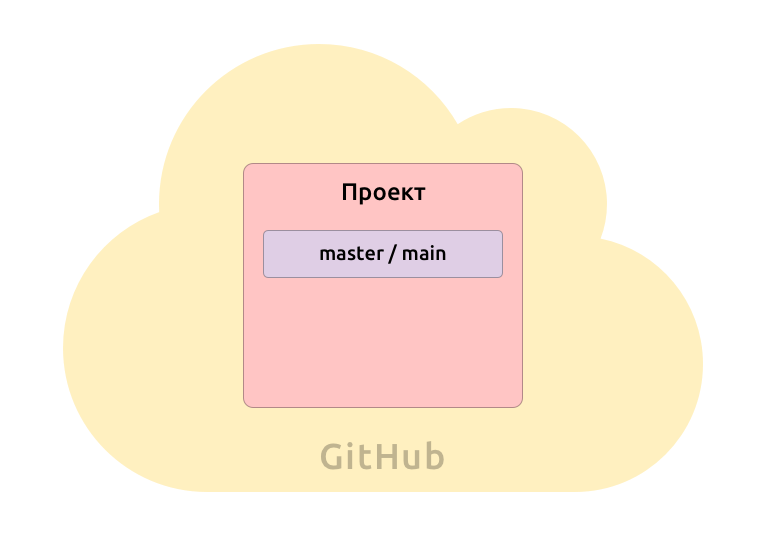
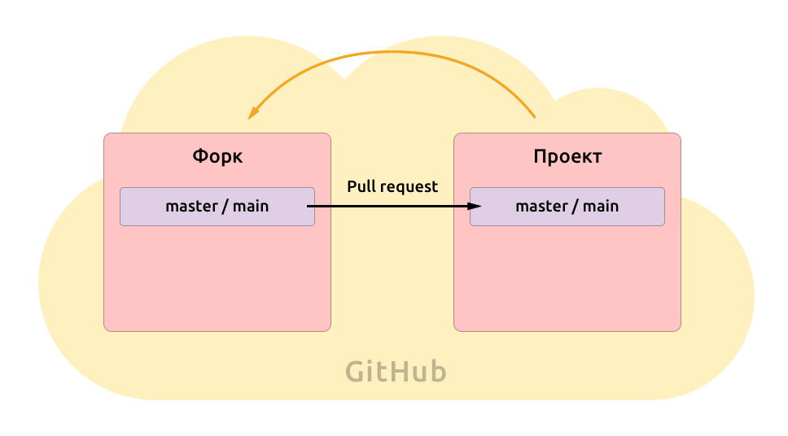
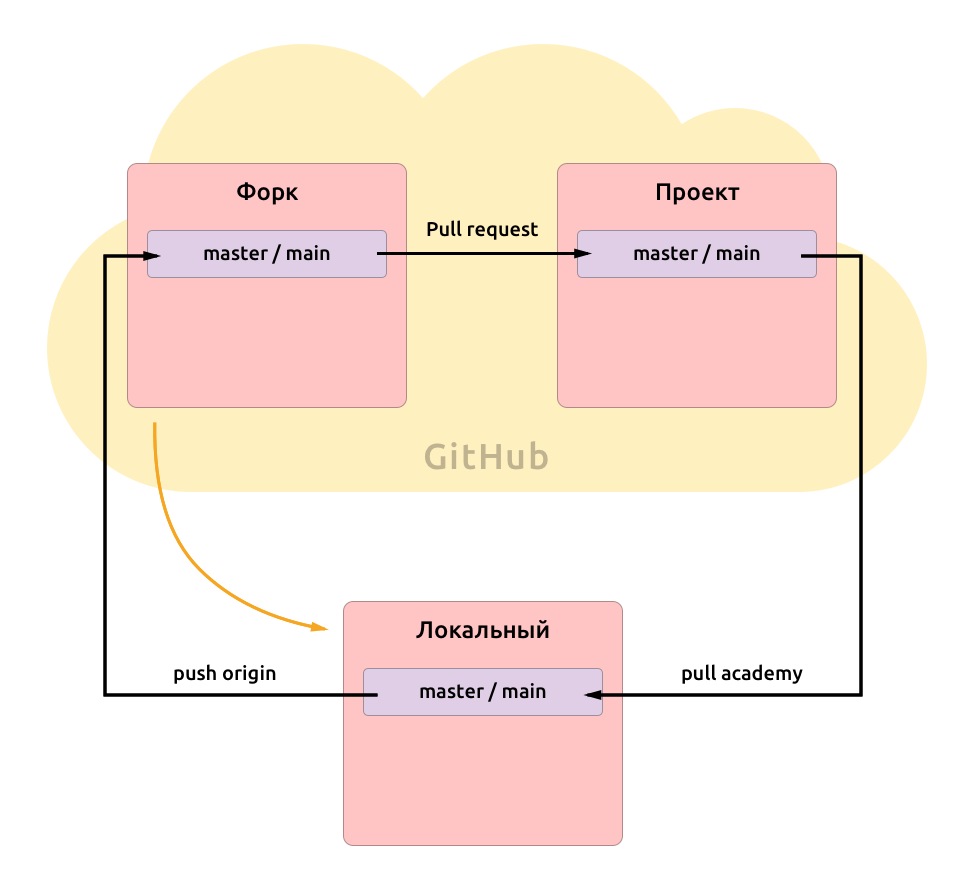
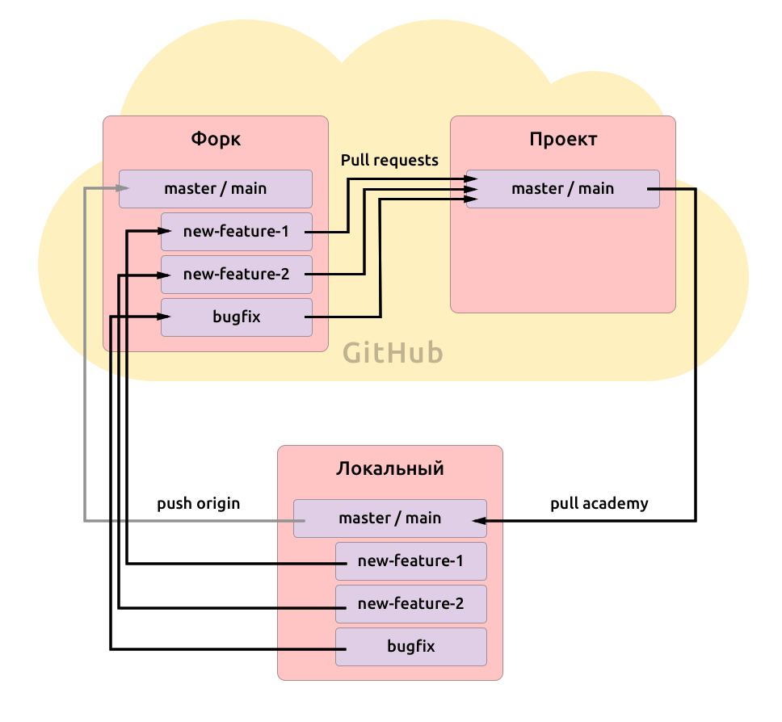

## The Problem

At some point, many beginners run into a Git process that feels unnecessarily complicated. It usually looks something like this:

1. clone the project repository;
2. create a new branch;
3. make your changes there;
4. push that branch to GitHub;
5. open a pull request;
6. wait for review;
7. merge the changes;
8. sync your local repository again.

At first glance, this raises a few reasonable questions:

- Why create a separate branch for every task?
- Why not just work directly in the main branch?
- Why open a pull request if I can already push changes?
- Why does teamwork through Git look so much more complicated than solo work?

Let’s break it down.

## From Abstraction to Reality

Let’s imagine this is not a training project, but a real one.

Suppose we are building a small website or web application. That is enough to explain the logic behind this workflow.

We also have a small team.

### Our Team

- **Team Lead** — the senior colleague with more experience and responsibility.
  They help keep the codebase stable and review changes.

- **Designer** — the person who creates the layouts and interaction logic.

- **Frontend Developer** — the person who implements the interface.
  That is us.

- **DevOps Engineer** — the person who sets up checks, pipelines, and deployment.

### Our Tasks

1. **The project should be deployed automatically when the main repository is updated**  
   Manual uploads are slow and unreliable. It is much better when deployment is automated and the repository stays the single source of truth.

2. **Several people should be able to work on the project at the same time**  
   Even if everyone has different responsibilities, people still touch related files. The process should prevent team members from constantly breaking each other’s work.

3. **The code should be checked automatically**  
   Teamwork requires shared standards. Otherwise, the codebase quickly turns into a mess. So we add automated checks to make sure the code matches agreed rules.

Git and GitHub help solve all of these problems.

## One Repository for Everyone. Or More Than One?

Let’s say the team already has a central GitHub repository for the project.

It is connected to build and deployment, so whenever it is updated, the project can be built and published automatically.

At the center of this setup is the `main` branch. In older projects, this branch may still be called `master`.

This branch contains the stable version of the project — the code that is trusted enough to be merged, built, and potentially deployed.

Because this branch is important, teams usually protect it. Not everyone is allowed to push directly into it. That reduces the chance of accidental breakage.

Which leads to a practical question:

If the main branch is protected, how do we actually work?

### So How Do We Work?

One common answer is simple: we work in our own branches and submit changes through pull requests.

In some setups, especially in open source or external collaboration, this may also involve a `fork` — a personal copy of the repository under your own account.

This gives you a safe place to work with full control, while still keeping a clean path for proposing changes back to the main project.

GitHub also keeps that relationship visible and makes it easy to create a **pull request** — a request to merge your changes into the shared repository.

That means the workflow is no longer just “write code and upload it.”
It becomes:

- make changes in isolation;
- send them for review;
- run checks automatically;
- merge only when the changes are ready.

That already solves a large part of the team coordination problem.

## Local Work Still Matters

Of course, nobody wants to edit code directly in the browser all day.

We want to work locally: in our own editor, with our own tools, and with the ability to test everything properly before sending it anywhere.

So we clone the repository to our computer and get a local copy.

This local repository is usually connected to GitHub through a remote called **origin**.

If the project also has a shared central repository, we may connect that as another remote too, so we can regularly pull in updates from the main project.

Now the structure starts to make sense:

- the local repository is where we work;
- the remote repository is where we share;
- the central repository is where the stable project lives.

## Reality Is Never Linear

The real reason team Git workflows become more structured is that real projects are messy.

Imagine this:

1. You start working on a large feature that will take several days.
2. Then a manager arrives with another task that suddenly becomes higher priority.
3. Then the designer finds a visual bug and asks for a quick fix that should be done immediately.

Now you are dealing with several parallel tasks, each moving at a different speed.

If all of your work is happening directly in the main branch, everything gets mixed together:

- half-finished feature work;
- urgent fixes;
- unrelated changes;
- experiments that may not even be ready.

That is exactly why branches exist.

## Branches

A branch is an isolated line of work inside the repository.

You can think of it as a separate workspace for a specific task.

For example:

1. You receive a feature request and create a branch called `new-feature`.
2. Then another task appears, so you return to `main` and create `new-feature-2`.
3. Then a bug appears, and you create `bugfix` from `main`, fix it quickly, and send that change for review.

Each branch exists independently.

That gives the team several important advantages:

- unfinished work does not pollute the stable branch;
- urgent fixes can move faster than large features;
- each task stays isolated and easier to review;
- it becomes much clearer what exactly is being changed.

When the work is ready, we open a pull request from that branch into the main branch of the shared project.

## Why We Should Not Work Directly in `main`

This is one of the key rules in team workflows.

If we write code directly in `main`, then `main` stops being a reliable base.

It becomes a mixture of:

- finished work;
- unfinished work;
- tested code;
- untested code;
- urgent edits;
- random experiments.

And once that happens, the team loses a lot:

- a stable starting point for new work;
- clean pull requests;
- confidence in deployments;
- clarity about what is actually ready.

That is why the usual approach is simple:

- keep `main` stable;
- create a branch for each task;
- review changes through pull requests;
- merge back only when everything is checked.

## What a Pull Request Really Does

A pull request is not just a formality before merge.

It solves several real problems at once.

### It creates a review point

Someone can look at the changes before they become part of the shared product.

### It keeps discussion attached to the code

Comments stay connected to the exact lines and decisions they refer to.

### It runs automated checks

Linters, tests, and build validation can run before merge.

### It keeps the scope visible

A good pull request makes it easy to answer one simple question:

**What exactly changed here?**

That matters because focused changes are easier to understand, review, and trust.

## Why This Feels Weird at First

Because beginners usually compare **team Git** to **solo Git**.

Solo Git is optimized for speed and convenience.

Team Git is optimized for:

- safety;
- coordination;
- visibility;
- predictable integration.

These are different goals.

What feels like “too many steps” is often just the minimum structure needed to avoid chaos once several people are working in the same codebase.

## A Simple Mental Model

If we reduce the whole thing to its core, the logic is very simple:

- `main` is the stable version of the project;
- branches are isolated workspaces for specific tasks;
- pull requests are checkpoints for review and validation;
- merging is the moment when the team accepts the change into the shared product.

That is the main idea.

Everything else is detail.

## When This Can Be Simpler

Of course, not every project needs the same level of process.

For a tiny personal project, a strict branch-and-review model may be excessive.

But once a project includes:

- multiple contributors;
- shared responsibility;
- automated checks;
- deployments;
- production risk,

then a structured Git workflow stops looking excessive and starts looking necessary.

## Final Thought

Teamwork through Git feels strange only until each step is connected to a real problem.

Branches protect unfinished work.
Pull requests protect quality.
A stable main branch protects the product.

So this process is not complicated for the sake of ceremony.

It exists because collaborative development is messy, and Git gives teams a way to keep that mess under control.

