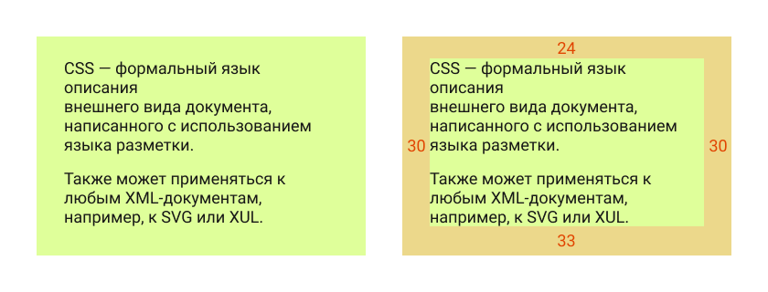
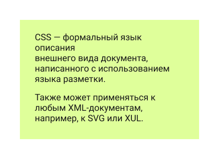
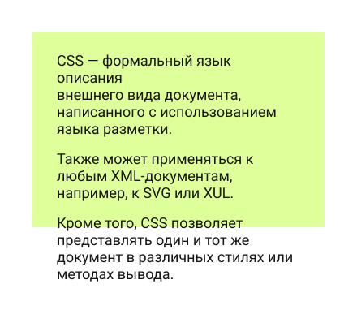
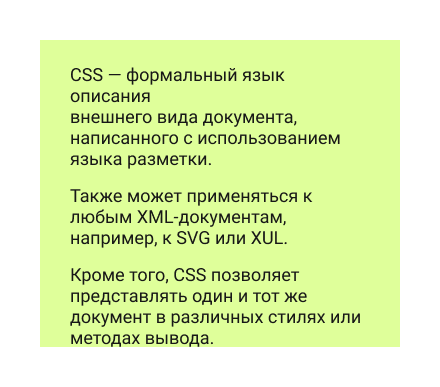
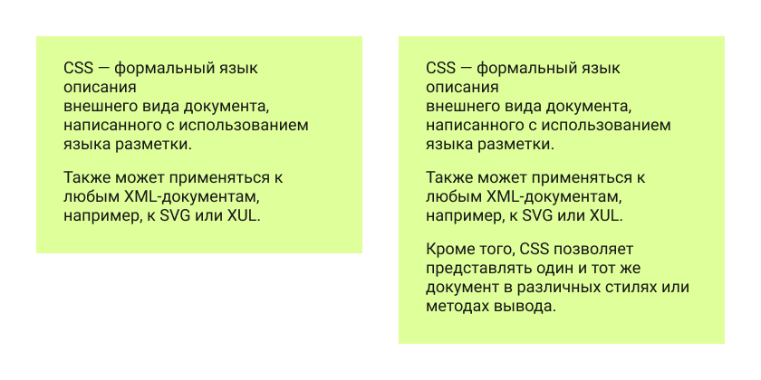
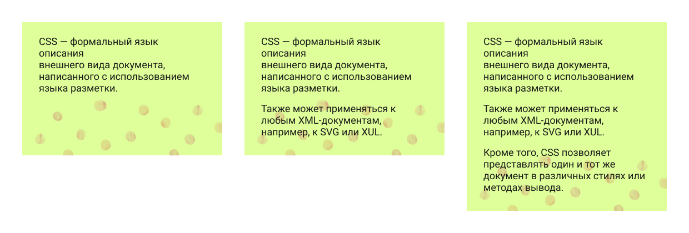
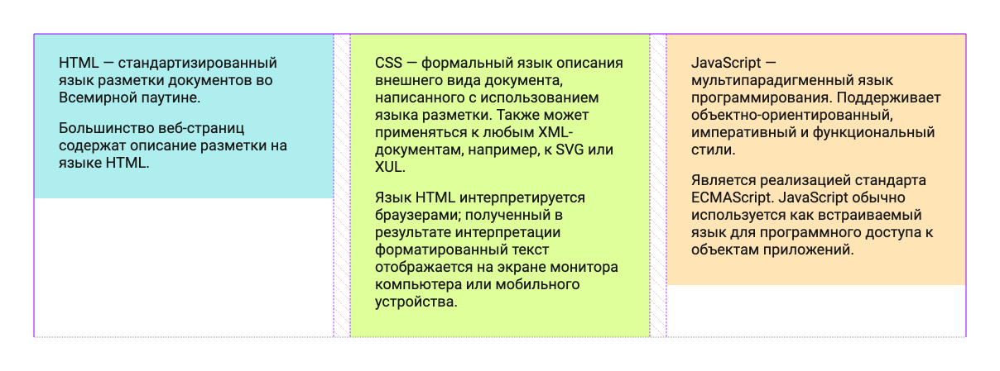

A lot of people, when working with their first layouts, use `height` to define element size.

It feels like one of the easiest ways to build a block and match the mockup.

Let’s code a very simple block that looks like this (the block itself and the same block with spacing dimensions):



This is a regular block containing two paragraphs of text. If we build it in the most straightforward way, we might end up with HTML like this:

```html
<div class="box">
    <p>CSS is a formal language used to describe the presentation of a document written in a markup language.</p>
    <p>It can also be applied to any XML-based documents, such as SVG or XUL.</p>
</div>
```

And CSS like this (I am skipping font setup and other unrelated properties):

```css
.box {
    width: 360px;
    height: 220px;
    padding-top: 24px;
    padding-right: 30px;
    padding-left: 30px;
    background-color: #dfff9a;
}
```

And the result will look exactly the way we want:



That is it. Or is it?

All right, I did cheat a little — but only to make the point clearer. In my defense, this is a very common mistake among beginners.

Of course, people are usually taught that using `height` here is incorrect, because websites are dynamic and the content inside the block may change. Suppose someone adds one more paragraph. This is what happens when height is fixed:



This is what you could call a *content overflow test*. Because the height is fixed, the text spills out of the block, which does not look great.

A better solution is to replace `height` with `min-height`. That way, we set the minimum height, and the text can stretch the block further if needed:

```css
.box {
    width: 360px;
    min-height: 220px;
    padding-top: 24px;
    padding-right: 30px;
    padding-left: 30px;
    background-color: #dfff9a;
}
```

So the problem is solved.  
But how well is it solved? Let’s see what the element looks like now during the same overflow test:



The block grows together with the content, which is better. But now the text is stuck to the bottom edge. That does not look especially nice, and the mockup clearly implies bottom spacing.

We could add bottom padding to the element. But if we are going to add the correct bottom padding anyway, then why do we need height at all? With the original text, the element will already look like it does in the mockup.

So instead of defining height in one form or another, we can shape the element using padding and end up with a much more flexible block:

```css
.box {
    width: 360px;
    padding-top: 24px;
    padding-right: 30px;
    padding-bottom: 33px;
    padding-left: 30px;
    background-color: #dfff9a;
}
```



## So when is `min-height` actually useful?

Not that often.

It is useful when an element cannot be smaller than a certain height, but can be taller if needed — which is exactly what `min-height` is meant for.

For example, imagine we have some kind of background that does not affect the content size, but still has to remain visible:



A slightly odd example, I know. If I find a better one, I will replace it =)

## What about width? Is it different?

This is really where we start touching on the broader skill of reading a layout properly.

Width is usually less critical, but it is still worth avoiding explicit widths when possible. For example, if the design has three such blocks in a row, we can build that with CSS Grid, and each block’s width will be defined by the grid itself.

In that case, the blocks do not need their own fixed width. They stop being rigid rectangles with hardcoded dimensions and instead become elements that fit into the grid and follow its size if it changes — which is especially useful for responsive layouts or later design updates:

```css
.boxes {
    display: grid;
    grid-template-columns: 1fr 1fr 1fr;
    gap: 20px;
    align-items: start;
    width: 1120px;
    margin: 0 auto;
}

.box {
    padding: 24px 30px 33px;
}
```



By avoiding fixed dimensions, we create more flexible blocks whose size can be controlled through the parent element — by adjusting the grid or flex layout.

This helps not only with building layouts that survive content overflow better, but also with preparing for responsive behavior. And trust me, that is something worth preparing for.
