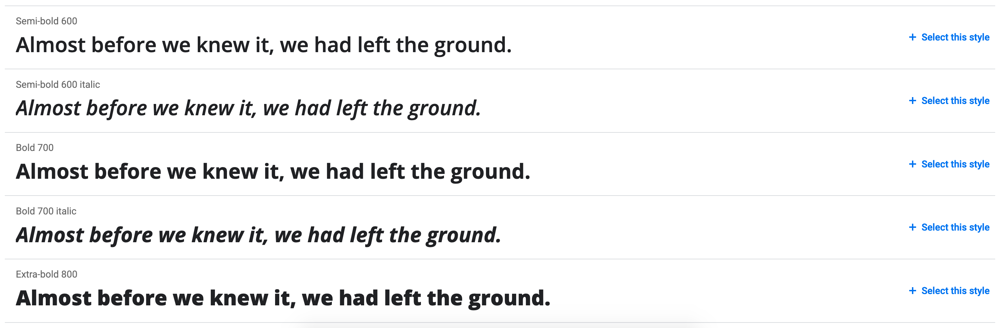
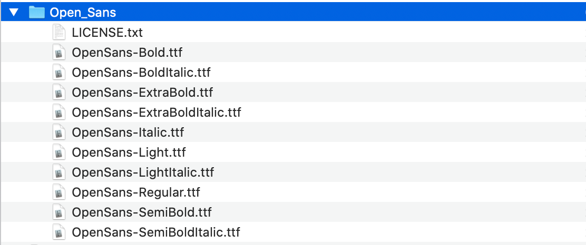

## What are the main ways to load fonts?

Speaking very broadly, there are two main ways to load fonts on a page: locally, or externally through a service like Google Fonts.  

Loading fonts through a service is fairly simple — you mostly just need to understand the Google Fonts interface. So we will not cover that option here and will focus on loading fonts locally instead.

If you are looking for the easiest route, there is probably not much for you here =)  
*(Though you may still want to read the last section — it is about how to specify a font properly.)*

## What fonts are made of

Let’s take a step back and look at font structure first. We will need that to understand what exactly we are working with.

*I would ask people who know typography well to relax a little: we are looking at this in the context of the web, so there is no need to overcomplicate it.*  

First of all, fonts can be divided into several basic categories. These are the main ones you are likely to encounter:

- serif fonts (**serif**);
- sans-serif fonts (**sans-serif**);
- monospaced fonts (**monospace**).

Let’s take **Open Sans** as an example. It is a sans-serif family, so it belongs to the **sans-serif** category. *Wait.* We were just talking about fonts — what do you mean by a **family**?

A **family** is a set of fonts united by a shared visual style. You could also call it a typeface, but in web development the term “family” is the more practical one.

Families are what have names: `Arial`, `Times New Roman`, `Helvetica`. **Open Sans** as well. Let’s open [Open Sans on Google Fonts](https://fonts.google.com/specimen/Open+Sans#standard-styles) and see what is inside:



So, quite a lot of variations. In practice, each variation is a separate font inside the Open Sans family.

If you download it, each font is represented by its own file:



It is easy to notice that fonts differ by two main properties: thickness, or **weight**, and **style**.  
A little further down you can also see the list of glyphs — letters and symbols included in the family. That only becomes important if you want to get deep into optimization:


Now that the structure is clear, let’s load the font.

## Breaking `@font-face` into pieces

To load a font in CSS, we use the `@font-face` rule:

```css
@font-face {
    ...
}
```

This rule loads a font — an actual font, and now we know what that means. Let’s use Open Sans as an example.

### The main font properties

- `font-family` — defines which family the font belongs to;
- `font-weight` — defines the font weight;
- `font-style` — defines the font style.

Be careful with `font-family`. It should contain the family name itself, so in our case it is `'Open Sans'`.

A common mistake is to write `'Open Sans Bold'` or `'Open Sans Italic'` there, which effectively creates separate one-font families. Then every time you want to change the weight, you also have to change the family name.

That is not how it should be done. `@font-face` exists specifically so that you can load different font files into one family and let the browser choose the correct file based on weight and style.

So the setup looks something like this:

```css
@font-face {
    font-family: 'Open Sans';
    font-weight: 400;
    font-style: normal;
}

@font-face {
    font-family: 'Open Sans';
    font-weight: 600;
    font-style: normal;
}
```

### Loading the files

As we already know, each font is stored in a separate file. That means every `@font-face` rule needs its own file reference. But, of course, it is not quite that simple.

Fonts come in many different formats. Fortunately, for modern browsers today, only two really matter: `woff` and `woff2`. `woff2` is newer and more efficient.

To connect the files, use the `src` property:

```css
@font-face {
    font-family: 'Open Sans';
    font-weight: 400;
    font-style: normal;
    src:
        url('../fonts/open-sans.woff2') format('woff2'),
        url('../fonts/open-sans.woff') format('woff');
}

@font-face {
    font-family: 'Open Sans';
    font-weight: 600;
    font-style: normal;
    src:
        url('../fonts/open-sans-semibold.woff2') format('woff2'),
        url('../fonts/open-sans-semibold.woff') format('woff');
}
```

It is important to keep the correct order and start with the more modern format — the one with slightly less support, but better optimization.

**Why?**  
The browser reads the list in order and loads the first format it supports. Every browser that supports `woff2` also supports `woff`. So if `woff` comes first, the browser will never even reach the more modern format.

### Optimizing font loading

A font file may only weigh a few dozen kilobytes. What is there to optimize?

Well, for starters, a font is often much more important than even content images, because 99% of websites deliver their most important information through text. So any delay in text rendering is highly noticeable, and users are very likely to feel it. Especially if the connection is slow or unstable.

You may have noticed that some websites show a blank white page for a moment while loading, while others first show text in one font and then switch to another.

That behavior is controlled by the `font-display` property. You could write a whole separate article about its nuances. In fact, there already is one — [Zach Leatherman’s article translated on CSS-live](https://css-live.ru/articles/ischerpyvayushhee-rukovodstvo-po-strategiyam-zagruzki-veb-shriftov.html), full of words and terrifying abbreviations like FOIT, FOUT, and FOFT.

I will keep it simple here: the default value, `auto`, usually behaves like `block`, which means that while the font is loading, the browser may hide the text entirely. That is not great, because the connection may be poor or even fail completely, leaving the visitor with no visible text.

Personally, I prefer `swap`: the browser first shows the text using a fallback font, then replaces it with the intended one as soon as it loads. Yes, this can cause a slight visual shift, but at least the text is available immediately:

```css
@font-face {
    font-family: 'Open Sans';
    font-weight: 400;
    font-style: normal;
    font-display: swap;
    src:
        url('../fonts/open-sans.woff2') format('woff2'),
        url('../fonts/open-sans.woff') format('woff');
}
```

On top of that, you can speed up font loading by adding a preload in the page `<head>` for the font files you know will definitely be needed. Then the browser starts fetching the font before it has even parsed the CSS and figured out which fonts are required:

```html
<link rel="preload" href="fonts/open-sans.woff2" as="font" type="font/woff2" crossorigin>
```

There is also another method: you can specify a local font name in the font source and let the browser check whether the user already has that font installed, which can eliminate the need to download any font files at all:

```css
@font-face {
    font-family: 'Open Sans';
    font-weight: 400;
    font-style: normal;
    font-display: swap;
    src:
        local('Open Sans'),
        url('../fonts/open-sans.woff2') format('woff2'),
        url('../fonts/open-sans.woff') format('woff');
}
```

Still, this should be used with caution, because the user might have some outdated or unofficial version of the font installed, and it may not look the same as yours.

And one last thing: fonts can also be split by glyph ranges and loaded only when characters from a certain range are actually needed.

This is well beyond the scope of a basic course — it is usually neither required nor explained there. But if you are curious, I would recommend Vadim Makeev’s talk [_____ ___ _____?](https://youtu.be/uI3Q5m9xkkw).

## How to specify a font correctly

And finally, how should you actually specify a font?

At first glance, it seems simple enough. There is the `font-family` property:

```css
font-family: 'Open Sans';
```

But in reality, this is not enough. You should also specify two more things:

- **a web-safe font** — a reasonably similar font that will be used if the main one fails to load. This should be one of the fonts that are widely available on major operating systems. You can find lists of such fonts [somewhere on the internet](https://www.cssfontstack.com/);
- **a generic font family** — essentially the broader font category, most often serif or sans-serif.

So the final declaration looks something like this:

```css
font-family: 'Open Sans', 'Arial', sans-serif;
```

> A small off-topic note. And a warning right away: this is not how we do it in the course =)  
> Personally, I think web-safe fonts are not especially useful. None of those old legacy fonts really looks like a modern one.  
> More than that, if you specify `sans-serif` directly, the system will use its own default sans-serif font. On modern macOS that will be San Francisco, and on Windows it will be Segoe UI. In practice, either of those is closer to Open Sans than ancient Arial or its relatives.  
> So in the end, the so-called web-safe font often just gets in the way.

There is one more important point related to inheritance. This applies not only to fonts, but fonts make it easy to explain.

Inside `font-family`, the logic is straightforward: the browser tries the first option, and if it cannot use it, it moves to the next one, and so on. If nothing works, the browser eventually falls back to Times New Roman, which is why we add the generic family at the end.

But here is the part that really matters. Many people define a full font stack on `body`, and then for nested elements with another font they only write the new family name without the fallback font and generic family:

```css
body {
    font-family: 'Open Sans', 'Arial', sans-serif;
}

.some-class {
    font-family: 'Gotham';
}
```

That is a serious mistake, because when the browser fails to load Gotham, it will not go back to the parent element and check which fonts were listed in `body`. CSS does not work like that.

The `font-family` property is considered completely overwritten. So for `.some-class`, it no longer matters what was specified on `body`. The browser tries Gotham, fails, runs out of options, and falls back to Times New Roman.

So the correct version looks like this:

```css
body {
    font-family: 'Open Sans', 'Arial', sans-serif;
}

.some-class {
    font-family: 'Gotham', 'Arial', sans-serif;
}
```

And now that is really it.  
Good luck!
