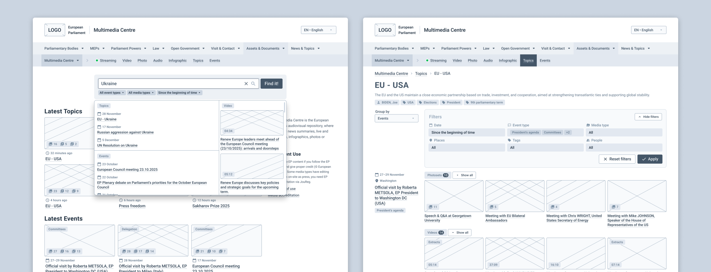
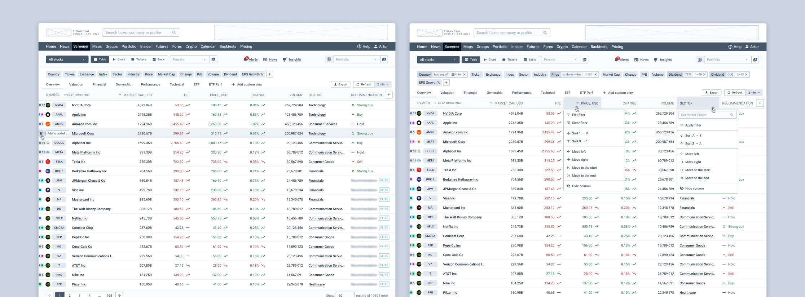
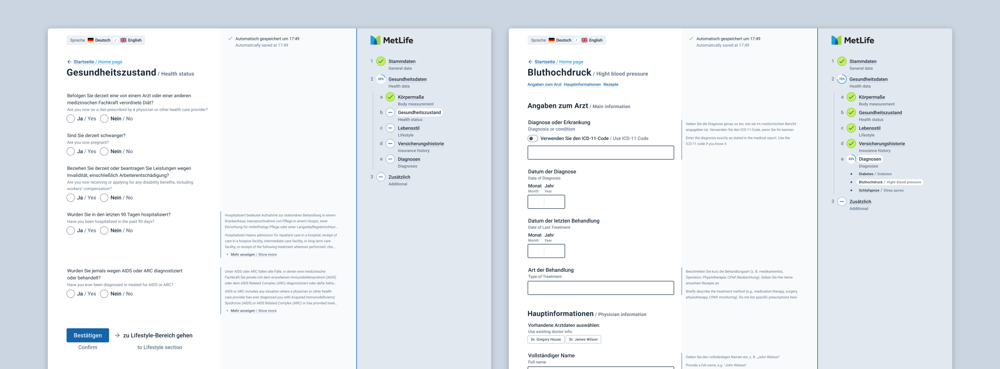
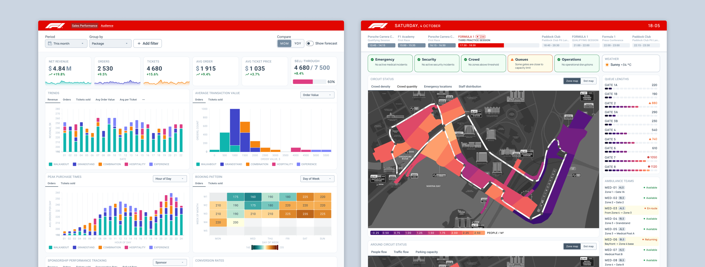

As I see it, in design there’s a lot of talk about spherical unicorns in a vacuum: abstractions, perfect solutions, perfect circumstances, double diamonds, and the same stuff. But once I found a newsletter in my inbox (no idea when or where I subscribed) that stood out from the rest by being practical and realistic.

It was Smart Interface Design Patterns by Vitaly Friedman from Smashing Magazine. Many recommendations are the kind you can apply right after you finish the email. That’s what pushed me to take UX Training. I expected the same approach there, and it delivered.

The training is built around 4 cases. Each one is based on a real project, and along with materials you also get the real-world limitations, gaps, and other annoyances that usually come with the job. I had to give 101% to dive in and work through each one. Here’s a quick overview of how it went for me:

## Case 1: Improve findability in a multimedia library and reduce the product’s impact on the environment

- **Pain points:** Search results are overloaded with too many items, the output is often irrelevant, navigation and filtering feel confusing.

- **Main challenges:** Reduce the number of steps to the final result, improve search efficiency, guide users toward “building” a better query.

- **My takeaways:** I finally connected the dots between filter shape, placement, and mechanics and how they support different user tasks. I also saw how the same tasks for filters turned into different scenarios because of mobile or desktop context. And I learned more about the link between UX and sustainability.

## Case 2: Design a stock screener and increase conversion to a paid subscription

- **Pain points:** The interface is hard to understand and requires a steep learning curve. The screen feels cluttered, features are hard to find. Tasks take too long, ads are irritating.

- **Main challenges:** Make interaction lighter while keeping the power. Group and organize a large amount of filters and data. Improve business KPIs through UX.

- **My takeaways:** I got a clearer approach for turning business metrics into UX tasks, measuring outcomes, and adjusting strategy. I also tried a few new practical methods, like an Event Storming.

## Case 3: Move an insurance registration form from PDF to a digital forms in multiple languages. Improve completion rate and time, reduce errors, and improve error recovery rate

- **Pain points:** Users aren’t motivated to fill the form. It requires focus, documents, and coordination with other people. There’s also a lot of terminology.

- **Main challenges:** Support multiple languages, including a “two languages at the same time” mode. Remove as many barriers as possible, make the form clearer, keep strict data validation without pushing users away.

- **My takeaways:** Forms were the area I’d worked with the least, so I tested a lot of new patterns and techniques around fields and field behavior. I also learned more about form design approaches, especially about designing the flow when several people are involved.

## Case 4: Create two dashboards for the Singapore Formula 1 Grand Prix: an analytical one for exploring sales, and an operational one for controlling things during the GP

- **Pain points:** Sales dynamics are hard to analyze, but too much data detail kills the big picture. During the GP you must keep track of many factors, and a lot of them require fast reaction.

- **Main challenges:** For analytics: cover quick status check and deeper exploration for insights on the same dashboard. For operations: show the “right now” situation and also help predict what’s coming based on the data.

- **My takeaways:** How to work with maps and combine different data types. I also tried designing “live ops” scenarios: working with data in a real-time mode and planning reactions to it.

For each case I spent several hours applying the prepared knowledge and approach in practice. Two cases had a strong team-work component, which was great because I work solo a lot. Team work gave me a chance to learn from the materials and from each other (everyone had their own superpower to share).

On top of that, I got valuable feedback from Vitaly on each piece. Importantly, it wasn’t a surface-level review: he dug into the ideas, followed the thinking, and pointed out strong and weak spots. That genuinely helped me move one step further in understanding UX nuances.

Sounds damn intense and hard, right? It is. And the best part is: it’s also really interesting and fun. Credit to Vitaly here: he knows how to create an open, safe, trustful atmosphere. That’s exactly what makes it productive and enjoyable, even when you’re pushing through a difficult challenge.

To wrap up: I’m not new to design, and I still didn’t find the “ceiling” of this workshop. There’s plenty to dig into and plenty of room to grow even for experienced designers. And if you’re a beginner — you’ll come back with a hell of a foundation. I can recommend it to anyone who wants to understand UX better.
